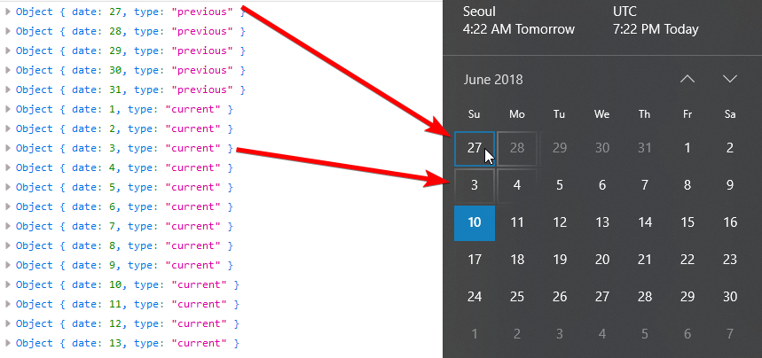
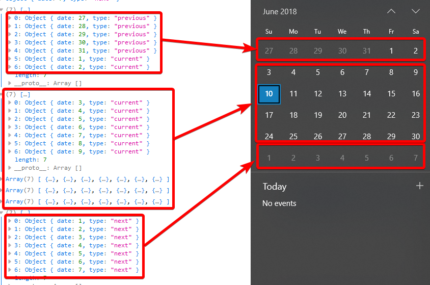

[](https://nodei.co/npm/calendar-dates/)

## What is this?

Get a list of calendar dates.  
**without an External Dependency**

You can use this to create your own calendar controls

## Installation

```bash
npm i calendar-dates
# or
yarn add calendar-dates
```

## API

### getDates(date)

- returns an array of objects in `{date: <date>, type: <type>}` format
- `<date>` - month day number
- `<type>` - Metadata to show if is `previous`, `current`, or `next` month date.
- 

### getMatrix(date)

- Same data as `getDates` but returns an array of 6 arrays of 7 elements (as in a calendar)
- 

## Examples

### CommonJS

```bash
const CalendarDates = require("calendar-dates");
const calendarDates = new CalendarDates();

const log = console.log;
const may2018 = new Date(2018, 4);

mainAsync = async () => {
  const mayDates = await calendarDates.getDates(may2018);
  const mayMatrix = await calendarDates.getMatrix(may2018);
  log(`May, 2018 Dates`, mayDates);
  log(`May, 2018 Matrix`, mayMatrix);
};
mainAsync();
```

#### Result

```bash
May, 2018 Dates [ { date: 29, type: 'previous' },
  { date: 30, type: 'previous' },
  { date: 1, type: 'current' },
  { date: 2, type: 'current' },
  { date: 3, type: 'current' },
...
  { date: 29, type: 'current' },
  { date: 30, type: 'current' },
  { date: 31, type: 'current' },
  { date: 1, type: 'next' },
  { date: 2, type: 'next' },
...
  { date: 9, type: 'next' } ]
May, 2018 Matrix [ [ { date: 29, type: 'previous' },
    { date: 30, type: 'previous' },
    { date: 1, type: 'current' },
    { date: 2, type: 'current' },
    { date: 3, type: 'current' },
    { date: 4, type: 'current' },
    { date: 5, type: 'current' } ],
  [ ... ],
  [ ... ],
  [ ... ],
  [ { date: 27, type: 'current' },
    { date: 28, type: 'current' },
    { date: 29, type: 'current' },
    { date: 30, type: 'current' },
    { date: 31, type: 'current' },
    { date: 1, type: 'next' },
    { date: 2, type: 'next' } ],
  [ { date: 3, type: 'next' },
    { date: 4, type: 'next' },
    { date: 5, type: 'next' },
    { date: 6, type: 'next' },
    { date: 7, type: 'next' },
    { date: 8, type: 'next' },
    { date: 9, type: 'next' } ] ]
```

### ES6 Module

`index.html`

```html
<html>

<head>
    <meta charset="utf-8" />
    <title>
        calendar-dates demo site
    </title>
</head>

<body>
    <script type="module" src="index.js"></script>
</body>

</html>
```

`index.js`

```javascript
import CalendarDates from "calendar-dates";
const calendarDates = new CalendarDates();

const main = async () => {
  for (const meta of await calendarDates.getDates(new Date())) {
    console.log(meta);
  }

  for (const meta of await calendarDates.getMatrix(new Date())) {
    console.log(meta);
  }
};

main();
```

#### Result

In a browser.

```bash
Object { date: 27, type: "previous" }
Object { date: 28, type: "previous" }
Object { date: 29, type: "previous" }
Object { date: 30, type: "previous" }
Object { date: 31, type: "previous" }
Object { date: 1, type: "current" }
Object { date: 2, type: "current" }
Object { date: 3, type: "current" }
...
Object { date: 30, type: "current" }
Object { date: 1, type: "next" }
Object { date: 2, type: "next" }
Object { date: 3, type: "next" }
Object { date: 4, type: "next" }
Object { date: 5, type: "next" }
Object { date: 6, type: "next" }
Object { date: 7, type: "next" }
Array(7) [ {…}, {…}, {…}, {…}, {…}, {…}, {…} ]
Array(7) [ {…}, {…}, {…}, {…}, {…}, {…}, {…} ]
Array(7) [ {…}, {…}, {…}, {…}, {…}, {…}, {…} ]
Array(7) [ {…}, {…}, {…}, {…}, {…}, {…}, {…} ]
Array(7) [ {…}, {…}, {…}, {…}, {…}, {…}, {…} ]
Array(7) [ {…}, {…}, {…}, {…}, {…}, {…}, {…} ]
```

## Change Log

2.0.0
Removed all methods except two methods, which return a promise.

1.  getDates(date)
1.  getMatrix(date)

Following methods are removed

1.  getDatesAsync
1.  getMatrixAsync
1.  getDatesWithMetadata
1.  getDatesWithMetadataAsync
1.  getMatrixWithMetadata
1.  getMatrixWithMetadataAsync

1.1.2  
Updated README to include `*WithMetadata` examples

1.1.1  
Fixed runtimeGenerator issue

1.1.0  
Added `*WithMetadata` methods

1.0.0
Added "\*Async" versions

## License

[MIT](https://github.com/dance2die/calendar-dates/blob/master/LICENSE)  
[](https://app.fossa.io/projects/git%2Bgithub.com%2Fdance2die%2Fcalendar-dates?ref=badge_large)
